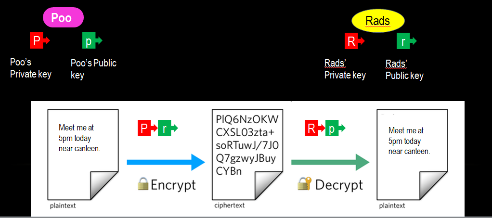
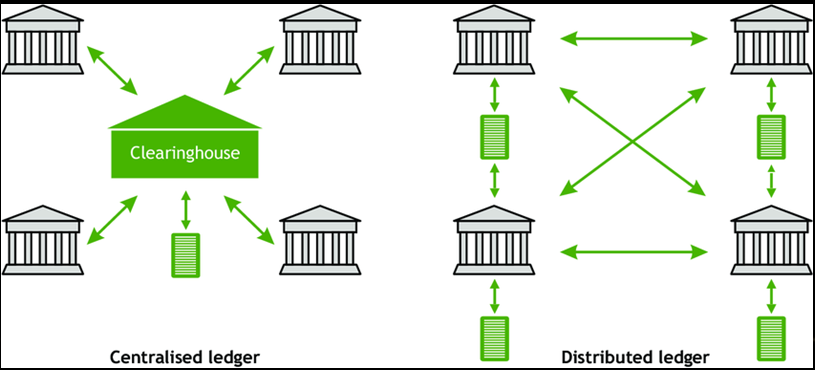
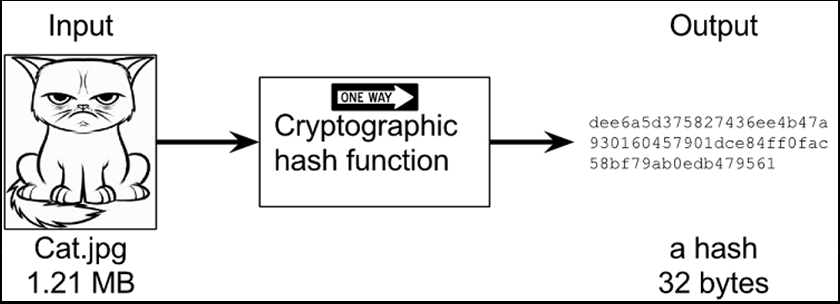

# BLOCKCHAIN 121

Blockchain is a trending technology but what are the underlying technologies which make it trending. Let's read about it.

## 1. Technologies involved in Blockchain
Blockchain involves three main technologies:

#### Private Key Cryptography
	Asymmetric Encryption : Generates a pair of key for an account namely a public key and a private key. Public key is visible to everybody and public key is only visible to you.

In the example above Poo wants to send a message to Rads via the network. So she takes her private key and Rads' public key to encrypt. It can only be decrypted by Rads as she has her private key and can get Poo's public key. Also there will be proof that it's coming from Poo only as it is encrypted by Poo's private key.
That's how integrityis maintained.

---

#### Peer-2-Peer Network
	
    Distributed ledger: No cenralized database everybody has a copy of all the data. 
    Majority: To make any changes/additions majority of votes is required.

In the example above there is a centralized server shown which keeps all the records. Any hacker can change the data from the centralized server. Whereas in the decentralized server everybody has a copy of the ledger so for changing any data the hacker needs to change it in more than 50% of the nodes. So the copy of ledger is true which is accepted by more than 50% of nodes.

#### Blockchain Protocol
Hashing: Converting any type/form of data to a fixed length string[hash] depending on its content.
    Properties of Hashing functions are: 

* One-way function : Cannot be reversed
* Avalanche effect : A slight change in data changes the data to a large extent.
* No duplicacy : Almost impossible to get the same hash.
* Content-based : The same content will give the same hash.

In the example above an image is converted to a 32 byte hash.
* Some best hashing functions are : SHA-256 and Keccak.  

_The probability of getting the same hash by different contents is lesser than the probability of your college getting hit by an asteroid._